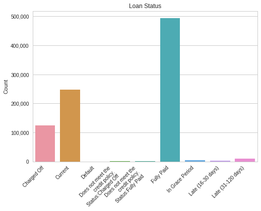
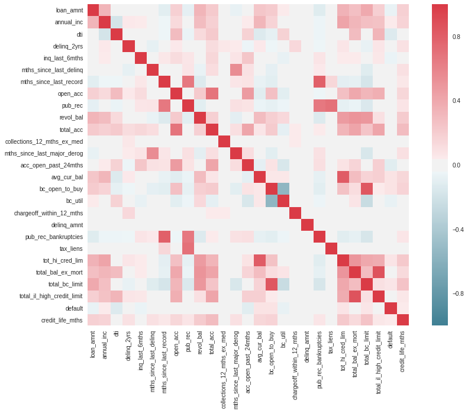
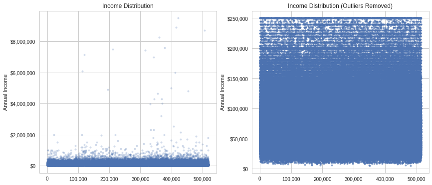
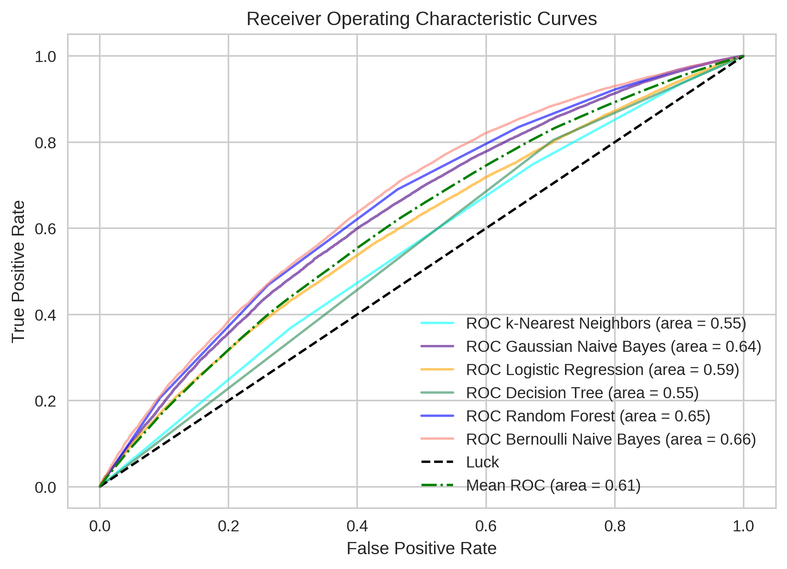
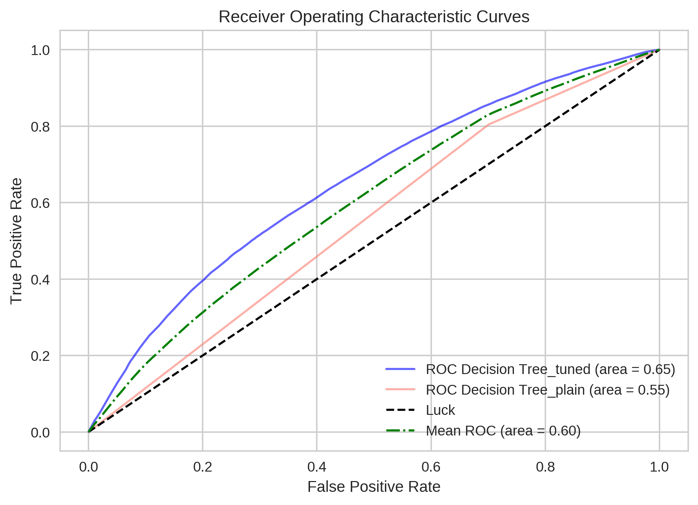
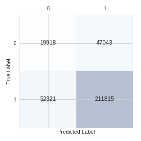
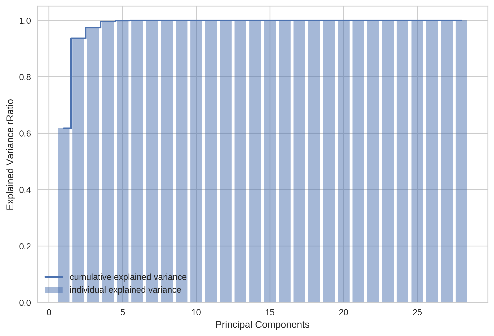

# **Predictive Modeling Project**

## Introduction

Lending Club is a US based company that provides an online platform for peer-to-peer lending. As the world's largest peer-to-peer lending platform the company has helped originate nearly $16 billion in loans through the end of 2015. These loans are unsecured personal loans between the investor (lender) and the borrower. Each borrower completes a loan application highlighting key financial characteristics such as annual income and credit history. Investors can browse through potential borrowers' applications and decide who to lend to, earning money from interest charged on the loan, while Lending Club charges the borrowers an origination fee as well as investors a servicing fee. A major element for an investor is analyzing applications to see which potential loans are most likely to be paid back and which ones may default.

Provided with a dataset containing loan data for active and completed (paid back or defaulted) loans the challenge is to provide a classification model predictive of default.

## Data Exploration and Preprocessing

The initial dataset was a collection of four data files downloaded directly from Lending Club's website. This data set had 887,449 observations with 143 features ranging from a borrower's annual income to their borrowing purpose over the years 2011 through 2015. For the purpose of this assignment only the features that would be available at the time of the loan application will be considered, since this is the information that an investor will have when making their lending decision. This analysis is supervised since our dependent, or *y* variable, is present. Those observations that do not have a *y* variable of default or paid-off, i.e. current loans, were removed.

Of the loans not considered *current*, they were combined into two categories, default or not default. The label was converted to a binary classifier with the positive class (1) notating a fully paid off loan while the negative class (0) is notated as a loan that defaulted.

Certain categorical variables were truncated from multiple categories down to a few. For instance, employment length had 11 different options which were condensed down into 3 main categories:
1. *less than or equal to  2 years*
2. *3 to 7 years*
3. *greater than or equal to 8 years*

The loan purpose feature was also combined into smaller categories:
1. *Debt payoff*
2. *Housing expenses*
3. *Large purchases*
4. *Medical expenses*
5. *Business expenses*
6. *Other* (this included anything from weddings to vacations)

Home ownership status was also combined into 3 categories:
1. *Rent*
2. *Mortgage*
3. *Own*

One key feature not included in the original dataset was the FICO credit score for the borrower. However, there were two features that were able to provide insight into how long the borrower has utilized credit, with the assumption (albeit imperfect) that the longer an individual has had credit the better their credit would be. The feature, *credit_life_mths*, was engineered using the earliest credit line date of the borrower and the application date to measure the total number of months a borrower has officially had credit.

Looking at the remaining numerical features, a correlation map was created to examine potential correlations among the features.

Reviewing this map, numerous features were removed. These features were above a correlation threshold of 75%, essentially measuring the same aspect as other features. Removing those superfluous features as well as removing any NaN values, I was able to then assess any outliers in the remaining numerical features.

Per the chart below, annual income had a handful of outliers. Only observations that were less than the 99th percentile were kept, under the assumption that if a borrower is making over $1 million dollars a year they would not need a small personal loan of less than $40,000 and that their supplied income was most likely erroneous.

Certain remaining numerical features, *delinq_2yrs*, *inq_last_6mths*, *pub_rec*, and *revol_bal*, any observation greater than 3 standard deviations from the mean was removed. With this the EDA Process was complete and I was left with 23 features across 441,463 observations. Six of these 23 features were categorical and were transformed into dummy variables.

## Classification Modeling

Of all the observations in the dataset, 80% were non-default or fully-paid off loans (positive class). Due to the heavily skewed nature of the label an accuracy score would not sufficiently measure the success of any model. For example, an accuracy score of 80% would be achieved by any model that is predicting non-default loans. Instead, recall, precision and specificity scores will be used, primarily specificity, as this is the fraction of loans that actually classify as negative, or loans that actually default. Given the nature of the lending business, predicting whether loans will default is deemed more important than predicting whether loans will not default.

I started off with baseline models for k-Nearest Neighbors, Gaussian Naive Bayes, Decision Tree, Random Forest and Logistic Regression, and Bernoulli Naive Bayes. I ran each of those models with different scoring parameters (*accuracy*, *precision*, *recall*, *f1*, and *roc_auc*) in the attempt to see which scoring parameter would provide a model with the highest specificity score. Although many of the models had higher precision and recall scores than the Decision Tree model, the Decision Tree model had the highest specificity score by far at 30% when using the *accuracy* scoring parameter. I also ran a ROC curve analysis. Although the Decision Tree model had one of the lower area under the curves, at 0.55, I still moved forward with fine-tuning the Decision Tree model since its specificity score was the highest and is the most important score for this project.

## Decision Tree Model Tuning

I began with a grid search for the best parameters. Once these hyper-parameters were tuned however, the specificity score dropped from 30% to 4% even though ROC area under the curve increased to 0.66. The predictions are also below.

## Conclusions

The success of the model is not great, and most likely not viable to use in a business setting as is. Additional metrics such as the FICO score of a borrower may prove helpful in augmenting the dataset. Further analysis of overfitting of the Decision Tree model may prove useful as well as further PCA. Although some features were removed due to high correlations with other features, per the PCA chart below, more than 95% of the variance can be explained by only 2 to 3 features.

